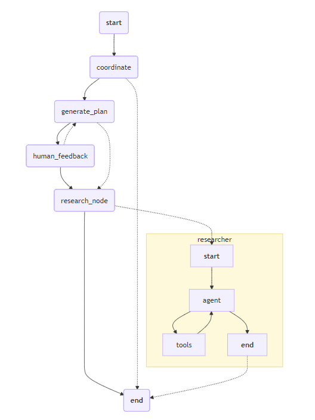
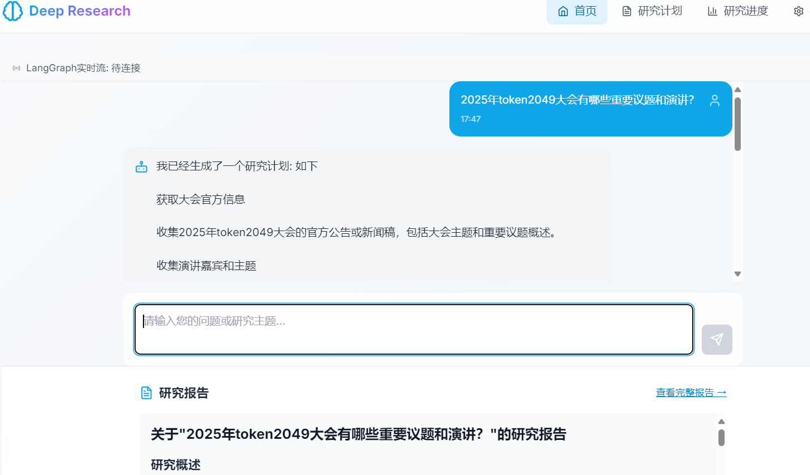

# Deep Research 
> 学习和借鉴Gemini Deep Research / Deerflow 项目 ，实现一个Deep Research 项目
## 后端
启动后端
```bash
cd backend
pip install -r requirements.txt
cp config.example.yaml config.yaml
uvicorn app:app --host 0.0.0.0 --port 8000
```

## 前端
启动前端
```bash
cd frontend
npm install
npm start
```

## 项目演示
langgraph 图 如下



运行效果如下



## TODO
- [ ] 引入 Critic Agent 评估模型输出
> 这里似乎可以和research node 并行，并通过langgraph的回溯机制来实现并行评估，但是我看到的deep research 项目似乎没有这样实现
- [ ] 优化上下文管理机制，希望可以一次生成10w 字符的研究报告

- [ ] 引入 RAG 机制，从知识库中提取信息，当前tool 只有 TavilySearch ，后续可以考虑引入其他工具
